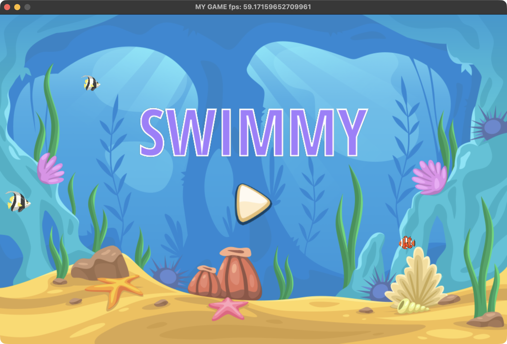
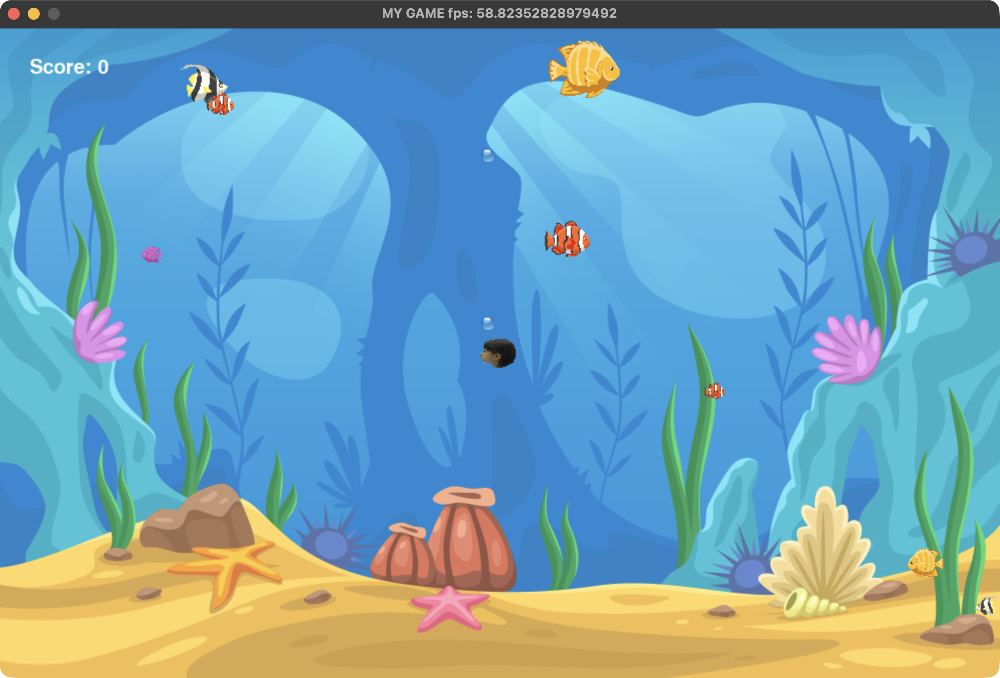
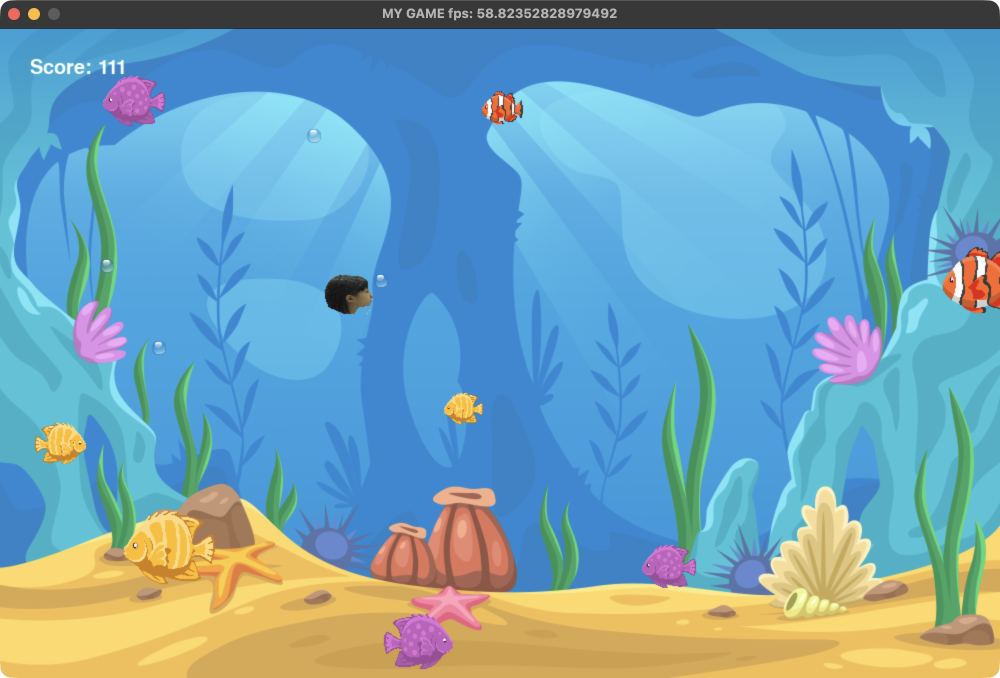

# Swimmy: Big Fish Eat Small Fish

## Description

Swimmy is a fun and engaging 2D underwater game built with Python and Pygame.  Players control a fish and navigate through an aquatic world, growing larger by consuming smaller fish while avoiding becoming prey to bigger ones. The game features simple controls, a scoring system, and visually appealing bubble effects.

## Images




## Key Features & Benefits

-   **Engaging Gameplay:** Experience the thrill of survival in a dynamic underwater environment.
-   **Simple Controls:** Easy-to-learn controls using arrow keys for movement.
-   **Scoring System:** Track your progress and strive for a high score.
-   **Visual Appeal:**  Enjoy colorful graphics and bubble animations that enhance the underwater setting.
-   **Educational Potential:** Demonstrates simple game development concepts using Pygame.

## Prerequisites & Dependencies

Before you begin, ensure you have the following installed:

-   **Python:** Version 3.6 or higher.
-   **Pygame:** A Python library for creating games.  Install it using pip:

    ```bash
    pip install pygame
    ```

## Installation & Setup Instructions

Follow these steps to get Swimmy up and running:

1.  **Clone the Repository:**

    ```bash
    git clone https://github.com/wenbintan0907/Swimmy.git
    cd Swimmy
    ```

2.  **Install Dependencies:**

    ```bash
    pip install pygame  # If you haven't already
    ```

3.  **Run the Game:**

    ```bash
    python src/main.py
    ```

## Usage Examples & Gameplay

-   **Controls:**
    -   **Up Arrow:** Move up
    -   **Down Arrow:** Move down
    -   **Left Arrow:** Move left
    -   **Right Arrow:** Move right

-   **Objective:**
    -   Eat smaller fish to grow bigger.
    -   Avoid larger fish to survive.
    -   Track your score displayed in the top-left corner.

-   **Gameplay Loop:** Bubbles automatically appear as your fish swims, adding to the visual experience.

## Project Structure

```
Swimmy/
├── .DS_Store         # (Optional) macOS metadata file
├── README.md        # This file!
├── assets/          # Directory containing game assets (images)
│   ├── BtnPlay.png
│   ├── BtnPlayIcon.png
│   ├── BtnRestart.png
│   ├── Bubble.png
│   ├── Fish01_A.png
│   ├── Fish01_B.png
│   ├── Fish01_open.png
│   ├── Fish02_A.png
│   ├── Fish02_B.png
│   ├── Fish02_open.png
│   ├── Fish03_A.png
│   ├── Fish03_B.png
│   ├── Fish03_open.png
│   ├── Fish04_A.png
│   ├── Fish04_B.png
│   ├── Fish04_open.png
│   ├── Fish05_A.png
└── src/
    └── main.py      # Main game script
```
